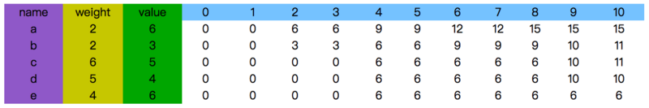
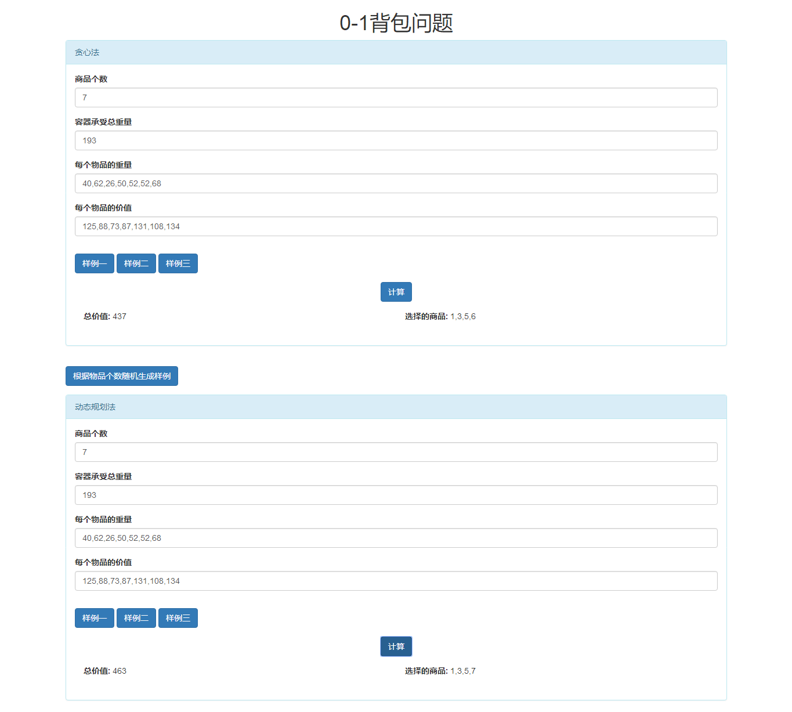
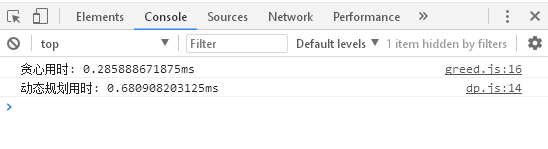
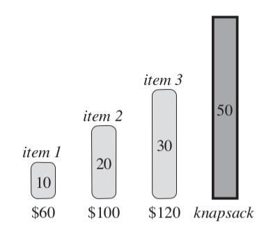
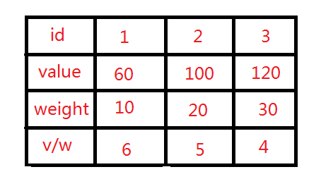
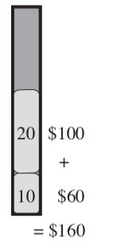
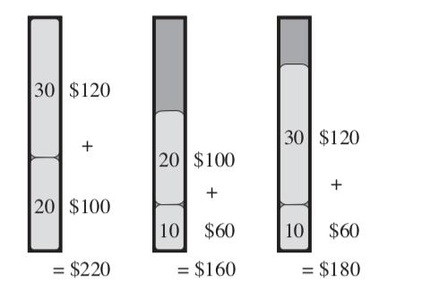

# 实验二 0-1 背包问题

## 一. 实验内容

分别编程实现动态规划算法和贪心法求 0-1 背包问题的最优解，分析比较两种算法的时间复杂度并验证分析结果。

## 二．实验目的

1.  掌握动态规划算法和贪心法解决问题的一般步骤，学会使用动态规划和贪心法解决实际问题；
2.  理解动态规划算法和贪心法的异同及各自的适用范围。

## 三. 算法描述

### 贪心法

1.  建立一个类数组对象 `sortArray` ，用来存储物品的重量、价值、单位重量价值、物品的编号
2.  根据单位重量价值对 `sortArray` 中的数据进行排序
3.  按照 `sortArray` 中的顺序遍历拿取物品，当背包所剩承受量小于物品重量时跳过

### 动态规划法

假设编号分别为 a,b,c,d,e 的五件物品，重量分别是 2,2,6,5,4，价值分别是 6,3,5,4,6，现在有一个承重为 10 的背包，如何装入物品具有最大价值？



这个表是从左下开始的，慢慢的推到右上角。第一行的蓝色部分表示背包此时的可承重量，当承重量为 0 时，不可能放入物品，所以总价值一直为 0。

`(a,10)` 就表示，abcde 五种物品放入承重量为 10 的背包中的最大价值，也就是本问题的解。

我们可以从本问题的最终解出发 `(a,10)`，首先对于物品 a，有两种选择，放入或者不放入

放入：放入物品 a，那背包承重就为 10-2=8，还剩 bcde 四种物品，该情况下的最大价值为 `(b,8)` + 物品 a 的价值

不放入： 背包承重不变，该情况下的最大价值为 `(b,10)`

最终会推出下面的式子，而动态规划的核心也就是状态转换方程

`(a,10) = max((b,8)+6,(b,10))`

同理求 `(b,8)` 或者 `(b,10)`，最终可以递归得到结果

## 四. 算法实现

### 贪心法

#### 数据结构

`sortArray`(类数组对象)

存储物品的重量，价值，单位重量价值和编号等信息

```js
sortArray.push({
  weight: m[i], //物品重量
  value: v[i], //物品价值
  ratio: parseInt((v[i] / m[i]).toFixed(2)), //物品价值/重量
  index: i + 1 //物品编号
})
```

#### 函数说明

主函数 `greed`

参数：

- n : 物品个数
- w : 容器所承受的重量
- m : 每个物品的重量
- v : 每个物品的价值

返回值(object)：

- value : 总价值
- select : 选择的物品的数组

```js
/**
 *
 * @param {物品个数} n
 * @param {容器所承受总重量} w
 * @param {每个物品的重量} m 数组
 * @param {每个物品的价值} v 数组
 *
 */
function greed(n, w, m, v) {
  var sortArray = [] //存储所有信息的数组
  var select = [] //选中的物品
  var value = 0 //商品总价值

  for (let i = 0; i < n; i++) {
    sortArray.push({
      weight: m[i], //物品重量
      value: v[i], //物品价值
      ratio: parseInt((v[i] / m[i]).toFixed(2)), //物品价值/重量
      index: i + 1 //物品编号
    })
  }
  //按单位重量价值排序
  sortArray.sort((a, b) => b.ratio - a.ratio)

  for (let i = 0; i < n; i++) {
    if (sortArray[i].weight > w) continue
    value += sortArray[i].value
    w -= sortArray[i].weight
    select.push(sortArray[i].index)
  }

  select.sort((a, b) => a - b)
  return { value, select }
}
```

#### 源程序代码

```js
/**
 *
 * @param {物品个数} n
 * @param {容器所承受总重量} w
 * @param {每个物品的重量} m 数组
 * @param {每个物品的价值} v 数组
 *
 */
function greed(n, w, m, v) {
  var sortArray = [] //存储所有信息的数组
  var select = [] //选中的物品
  var value = 0 //商品总价值

  for (let i = 0; i < n; i++) {
    sortArray.push({
      weight: m[i], //物品重量
      value: v[i], //物品价值
      ratio: parseInt((v[i] / m[i]).toFixed(2)), //物品价值/重量
      index: i + 1 //物品编号
    })
  }
  //按单位重量价值排序
  sortArray.sort((a, b) => b.ratio - a.ratio)

  for (let i = 0; i < n; i++) {
    if (sortArray[i].weight > w) continue
    value += sortArray[i].value
    w -= sortArray[i].weight
    select.push(sortArray[i].index)
  }

  select.sort((a, b) => a - b)
  return { value, select }
}
```

### 动态规划

#### 数据结构

`bagMatrix[i][j]`(二维数组)

- i 代表容器所剩的重量
- j 代表可以放入 0-j 的物品

通用变量

```js
@param {商品个数} n
@param {容器总容积} w
@param {各个商品的重量} m
@param {各个商品的价值} v
```

#### 函数说明

**获取最优值**

返回值:

- 最优值

```js
function getMaxValue() {
  for (let i = 0; i <= w; i++) {
    bagMatrix[i] = [] //生成二维数组
    for (let j = 0; j < n; j++) {
      //如果背包的容量为 0
      if (i === 0) {
        bagMatrix[i][j] = 0
        continue
      }
      //背包的容量小于物品j的重量，那物品j就不存在可以装上
      if (i < m[j]) {
        bagMatrix[i][j] = bagMatrix[i][j - 1] || 0
      } else {
        bagMatrix[i][j] = Math.max(
          (bagMatrix[i - m[j]][j - 1] || 0) + v[j],
          bagMatrix[i][j - 1] || 0
        )
      }
    }
  }
  return bagMatrix[w][n - 1]
}
```

**获取选择到的物品**

参数:

- weight : 容器承受量

返回值:

- select : 选择到的物品

```js
function getSelectItem(weight) {
  let select = [] // 选择的物品
  for (let j = n - 1; j >= 0; j--) {
    try {
      if (
        bagMatrix[weight][j] ===
        (bagMatrix[weight - m[j]][j - 1] || 0) + v[j]
      ) {
        weight -= m[j]
        select.push(j + 1)
      }
    } catch (err) {}
  }
  return select
}
```

#### 源代码程序

```js
/**
 *
 * @param {商品个数} n
 * @param {容器总容积} w
 * @param {各个商品的重量} m
 * @param {各个商品的价值} v
 */
function dp(n, w, m, v) {
  let bagMatrix = []
  let maxValue = 0
  let select = []

  function getMaxValue() {
    for (let i = 0; i <= w; i++) {
      bagMatrix[i] = [] //生成二维数组
      for (let j = 0; j < n; j++) {
        //如果背包的容量为 0
        if (i === 0) {
          bagMatrix[i][j] = 0
          continue
        }
        //背包的容量小于物品j的重量，那物品j就不存在可以装上
        if (i < m[j]) {
          bagMatrix[i][j] = bagMatrix[i][j - 1] || 0
        } else {
          bagMatrix[i][j] = Math.max(
            (bagMatrix[i - m[j]][j - 1] || 0) + v[j],
            bagMatrix[i][j - 1] || 0
          )
        }
      }
    }
    return bagMatrix[w][n - 1]
  }

  function getSelectItem(weight) {
    let select = [] // 选择的物品
    for (let j = n - 1; j >= 0; j--) {
      try {
        if (
          bagMatrix[weight][j] ===
          (bagMatrix[weight - m[j]][j - 1] || 0) + v[j]
        ) {
          weight -= m[j]
          select.push(j + 1)
        }
      } catch (err) {}
    }
    return select
  }

  maxValue = getMaxValue()
  select = getSelectItem(w)

  select = [...new Set(select)]
  select.sort((a, b) => a - b)

  return { maxValue, select }
}
```

## 五．程序运行结果

- 输入商品个数，单击根据物品个数随机生成样例；贪心法和动态规划可以生成相同的随机数据，
- 也可以点击样例一二三来生成我已经事先写好的样例，
- 也可以自己手动输入样例





## 六．实验结果分析

根据实验结果可以清楚看出贪心法有时无法取得最优解，举个栗子

例如下面我们有三种物品，他们的重量和价格分别为 10，20，30kg 和 60，100，120



根据他们的单位重量价值排序为



因此根据其 v/m ,首先选的就是重量为 10 ，价值为 60 的物品。然后选择重量为 20，价值为 100 的物品。现在所用的重量就为 30，剩下 20，但是最后一个物品重量有 30 ，所以无法装入。



按照贪心算法，这应该得到的价值就是最大的。我们看一下所有的情况



显然按照贪心算法得到的并不是最优解，反而是价值最低的。

贪心算法的时间复杂度为 O(n) 动态规划的为 O(n*w)，也可以看出动态规划用的时间多于贪心


## 七．结论

贪心虽然所用的时间短，但是对于某些 0-1 背包问题无法取得最优解，动态规划所用时间略长但是可以取得一个最优解。

贪心所求问题的整体可以通过一系列局部最优的选择去解决，而动态规划需要根据其最优子结构的性质和重叠的子问题列出状态转换方程进行求解