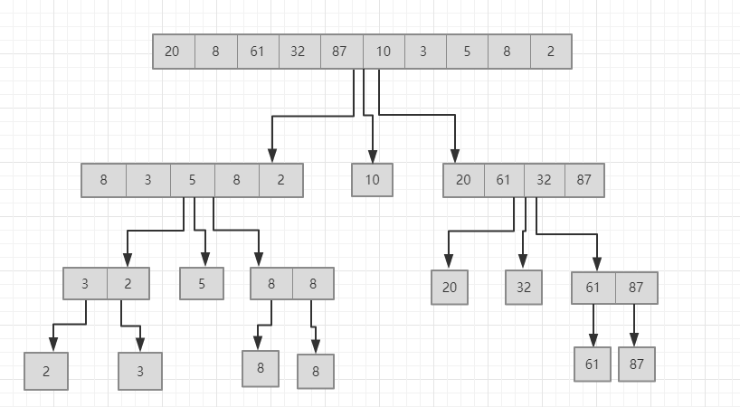

# 实验要求

运用分治递归思想，编程实现快速排序算法。通过不同实例测试，分析最坏、最好、平均情况下的时间复杂度，并设计实验程序验证分析结果

# 概念

> 分治法的设计思想是，将一个难以直接解决的大问题，分割成一些规模较小的相同问题。
> 直接或间接地调用自身的算法成为递归算法

## 快速排序介绍

### 方法一

**算法步骤**

1. 找到该数组的基准点「中间数」，并创建两个空数组 `left` 和 `right`
2. 遍历数组，将比基准点小的放到 `left` 数组中，将比基准点大的放到 `right` 数组中
3. 对数组 `left` 和 `right` 进行递归调用

**举例**

`20 8 61 32 87 10 3 5 8 2`

这种方法虽然简单易懂，也能深刻的理解到分治的思想，但是也存在很大的问题，因为在每次递归中都额外的生成了两个数组，会造成空间复杂度飚升，因此标准快排应该是利用**原数组**进行操作。

### 方法二

**算法步骤**

1. 以数组右部为基准值， 比其小依次从数组开头进行交换，最后把基准值也替换到紧挨着先前交换的位置，让其左边都是小于基准值，右边都是大于基准值
2. 然后对两边重复上面的步骤

具体细节可以看源码，里面注释也写得非常清楚。

## 时间复杂度

平均复杂度和最好的复杂度都为 O(nlogn),最坏的情况就是每次基准分组都严重失衡，一侧只有一个，剩下的都在另一次，这样的算法复杂度就为 O(n²);

**改进**

为了避免这种情况，可以每次取中值为基准值