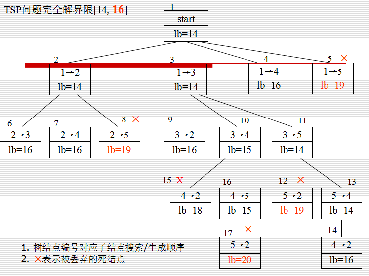

# 旅行商问题

## 问题描述

旅行商问题（Traveling Salesman Problem,TSP）是旅行商要到若干个城市旅行，各城市之间的费用是已知的，为了节省费用，旅行商决定从所在城市出发，到每个城市旅行一次后返回初始城市，问他应选择什么样的路线才能使所走的总费用最短？

## 要求

分别编程实现回溯法和分支限界法求TSP问题的最优解，分析比较两种算法的时间复杂度并验证分析结果。

## 回溯法

回溯法的本质也是搜索，旅行商问题可以将所有的路径都排列出来，然后搜索其中最短的路径。只不过回溯法加了约束条件，使搜索的次数减少了

## 分支限界法

分支限界法类似于回溯法，但是与其求解目标不同。回溯法求解目标是找出解空间中满足约束条件的所有解，而分支限界法的求解目标则是找出满足约束条件的一个解，或是在满足约束条件的解中找出使某一目标函数值达到极大或极小的解

> 由于求解目标不同，导致分支限界法与回溯法对解空间的搜索方式不同。回溯法以深度优先的方式搜索，而分支限界则以广度优先或以最小耗费优先。

我们可以用贪心算法计算问题的上界。以起始城市作为出发城市，每次从当前出发城市发出的多条边中，选择没有遍历过的最短边连接的城市，作为下一步达到城市。在这个问题中，从城市1出发，途经1→3→5→4→2→1，路径长度1+2+3+7+3=16作为上界，即最短路径长度<=16。对于下界，一个简单的办法是直接将矩阵中每一行的最小元素相加，在这个问题中，路径长度1+3+1+3+2=10作为下界，即最短路径长度>=10。更优的计算方式是将矩阵中每一行最小的2个元素相加除以2并向上取整。因为在一条路径上，每个城市有2条邻接边：进入该城市、离开该城市。对每一步经过的城市j，从最近的上一个城市i来，再到下一个最近城市k去，即i→j→k。在这个问题中，路径长度{(1+3)+(3+6)+(1+2)+(3+4)+(2+3)}/2向上取整等于4作为下界，即最短路径长度>=14。因此，以最短路径长度dist作为TSP问题目标函数，则dist的界为[14,16]。在问题求解过程中，如果1个部分解的目标函数dist下界超出此界限，则该部分解对应了死结点，可剪枝。对于1条正在生成的路径/部分解，设已经确定的顶点(已经经过/遍历的城市)集合为U=(r1, r2, …, rk)，则该部分解的目标函数的下界为(已经经过的路径的总长的2倍+从起点到最近未遍历城市的距离+从终点到最近未遍历城市的距离+进入/离开未遍历城市时各未遍历城市带来的最小路径成本)除以2并向上取整。假设正在生成的路径/部分解为1→4,U={1,4},未遍历城市={2,3,5},该部分解下界为{2*5+1+3+(3+6)+(1+2)+(2+3)}/2向上取整等于16。

