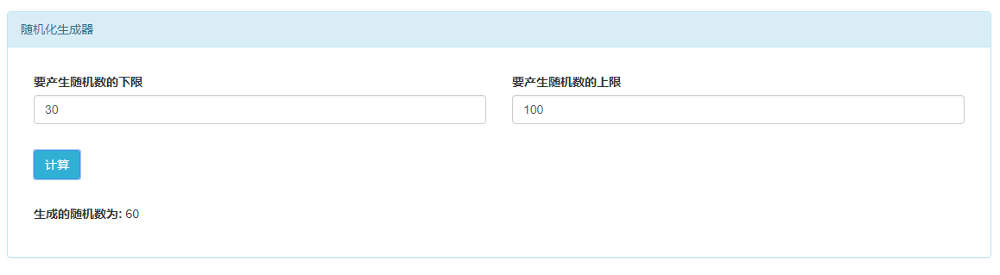

# 实验四 随机数产生器

## 一. 实验内容

设计一个随机数发生器，可以产生分布在任意整数区间[a,b]的随机数序列。

## 二．实验目的

1.  掌握线性同余法产生随机数的方法；
2.  了解计算机中的随机数是如何产生的，以及为什么将随机数称为伪随机数。

## 三. 算法描述

线性同余法是产生伪随机数常用的方法


生成的伪随机数序列最大周期 m，范围在 0 到 m-1 之间。要达到这个最大周期，必须满足
c 与 m 互质
a - 1 可以被 m 的所有质因数整除如果 m 是 4 的倍数，a - 1 也必须是 4 的倍数以上三条被称为 Hull-Dobell 定理。

## 四. 算法实现

### 数据结构

`today` 此时时间戳

### 函数说明

`rnd` 返回种子

```js
function rnd(seed) {
  seed = (seed * 9301 + 49297) % 233280 //为何使用这三个数?
  return seed / 233280.0
}
```

`rand` 根据时间戳返回随机数

```js
function rand(number) {
  today = new Date()
  seed = today.getTime()
  return Math.ceil(rnd(seed) * number)
}
```

### 源代码程序

```js
function rnd(seed) {
  seed = (seed * 9301 + 49297) % 233280 //为何使用这三个数?
  return seed / 233280.0
}

function rand(number) {
  today = new Date()
  seed = today.getTime()
  return Math.ceil(rnd(seed) * number)
}

var calc = document.getElementById('calc')
var value = document.getElementById('value')

calc.onclick = function() {
  var numTop = parseInt(document.getElementById('numTop').value)
  var numBottom = parseInt(document.getElementById('numBottom').value)

  var numMid = numTop - numBottom // 间隔的数值
  var num = rand(numMid) + numBottom

  value.innerText = num
}
```

## 五．程序运行结果



## 六．实验结果分析

生成的随机数是伪随机数，是一些有规律的随机数

## 七．结论

从工程的角度来讲，`(m-1)a + c` 的值要（在合理的范围内）足够小，以避免溢出的问题。

从安全（实用）性的角度来讲，还要满足良好的随机性