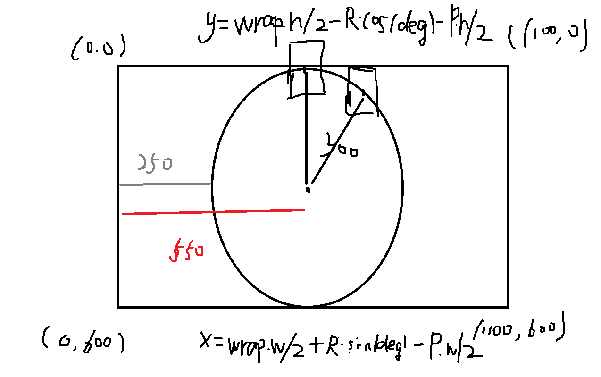

# 圆形展示散列画廊

这个小作品源于当时在某课网看的散列画廊的视频，它是分为左右两个区域。此次将其效果实现成圆形排列、中央展示

## 思路图示



## 思路解释

要想展示成圆形图排列，要根据图片个数来确定每个图片的中心坐标和旋转角度。

图片自身的旋转角度和以大圆为中心的图片位置的旋转角度就为360度/图片个数，然后最关键的是我们要确定每个图片的x,y坐标，我们以图中第二张图片为例,它的**x坐标**就是wrap层的宽度的一半 + 中心圆半径\*sin(当前图片的旋转角度) - 图片自身宽度的一半，**y坐标**就是wrap层的高度的一半 - 中心圆半径\*cos(当前图片的旋转角度) - 图片自身的一半.

### 关键代码

```javascript
//这里一定要减一
var picNum = data.length-1;

var deg = 360 / picNum * (Math.PI*2/360);
//中心圆的半径
var circleR = wrap.h / 2;
//wrap为长方形包裹层 
//circleR为中心圆半径
for(let i=0;i<picNum;i++){
    range.x[i] = wrap.w / 2 + circleR*Math.sin(deg*i) - photo.w / 2;
    range.y[i] = wrap.h / 2 - circleR*Math.cos(deg*i) - photo.h / 2;
    range.deg[i] = i*deg/(Math.PI*2/360);
}
```
如没有看懂或者说觉着本小白解释的不清楚的还请多多见谅或者私戳我(hutchinsxb@qq.com)，一定改过自新，重新做人，下面是效果展示.

[效果展示](http://haoqinzz.cn/circleShow/)

