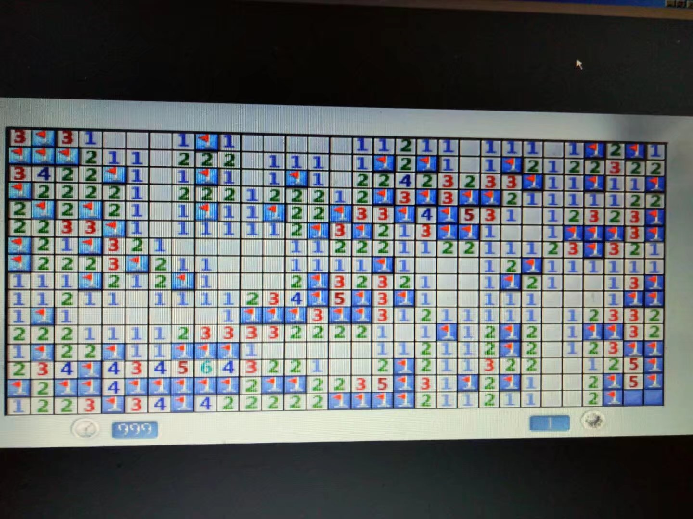
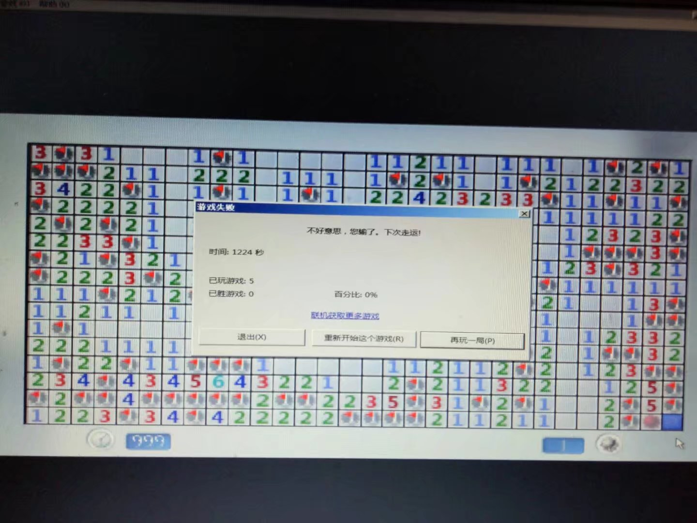
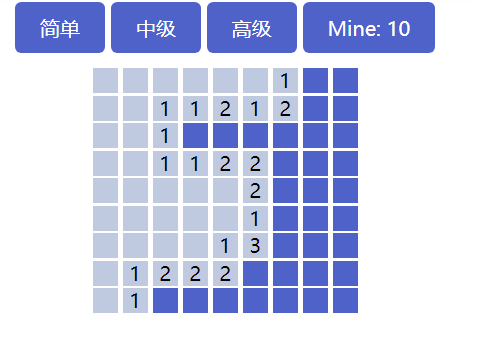

# 简易扫雷

## 引言

前阵子无聊,LOL也不是很想玩,发现了电脑中自带的扫雷,当时在一个神奇的地方，用的是一个windows2000的系统界面但是扫雷确是win7的样式,玩了几句几局，其中有一局很崩溃，我先上图为敬。



这种情况,就是考验运气的时候了，但是果不其然。。。



我成功选择了有炸弹的那一个，从这里面我明白了一个道理，那就是：**成功需要99%的努力再加上1%的运气**。。。。。。

## 原理(思路)

### 布局

玩了几句搞清了游戏规则,就想自己动手做一个,因为以前做过2048,所以首先想到的就是用二维数组布局

添加三个难度的按钮

```html
<a class="type" href="#" data-width="9" data-height="9" data-mine="10">简单</a>
<a class="type" href="#" data-width="16" data-height="16" data-mine="40">中级</a>
<a class="type" href="#" data-width="30" data-height="16" data-mine="99">高级</a>
```

点击相应按钮通过js获取对应的data属性,然后动态的生成相应的方格,然后动态计算包裹所有小方格的宽度和高度,为了以后方便操作每一个小方格,给每一个小方格按行列添加独有的id。

### 盒子对象

#### 属性

因为扫雷是对每个格子进行操作，因此我把每个格子都看成一个独立的个体，这个个体具有属性和方法，就相当于一个小对象。定义了两个数组

```js
//代表盒子身份的数组
var boxArr = [];
//用于存储周围八个格子中雷的个数
var MineArr = [];
```

通过这两个数组,我可以知道每个格子是否是炸弹,还有每个格子周围对应八个格子中有多少个炸弹，这属于格子对象的属性。

#### 方法

盒子对象还有鼠标按下和抬起的方法，这里要注意，不要给每个盒子都添加事件。假设有100个盒子的话，就要添加100个事件，事实上高级难度下的盒子话还有更多，这样就不如在``container``上绑定事件，利用冒泡。也可以实现相同的效果，并且只需要绑定一个事件

```js
container.on('mousedown', '.box', function (e) {
  $(e.target)//获取点击到的class为box的元素
}
```


，有的时候格子的``MineArr``里面存的可能是0,这就代表他周围8个不存在炸弹,像这种的话就直接将其周围的八个格子直接自动点开就好了,下面这幅图，我只点了一下,就是点到了``MineArr[i][j]==0``的格子,然后让他周围八个直接显示``MineArr``中的数值,如果周围八个格子还有``MineArr[i][j]==0``的情况，就继续打开去显示。



扫雷中还有一个一定要有的方法就是左右键一起按一个点开的格子，会自动判断周围格子中你标记雷的个数和你点击的这个格子的数值。如果你标记雷的个数等于左右键点击的格子中的数值，他会自动帮你点开剩下的还没点击过的格子，这些格子中可能有雷也可能没雷，这要看你自己标记的雷是不是对的。

这个也蛮好实现,右键按下的时候将周围没点击过也没被标记过雷的方格添加带有别的颜色的``class``，然后记录周围八个方格标记的雷的个数，然后在右键松开的时候移除此``class``,并判断刚记录的标记的雷的个数和当前点击的格子的数值是否相等，然后去做下一步处理。

### 成功失败判断

失败很好判断，点中了``boxArr``为1的格子就判失败，就是点中了雷。

成功的话我是通过点击出来的格子的数量来判断的，成功显现的格子只要等于总格子减去雷的格子就判断为游戏胜利


## 总结

虽然是一个比较简单的游戏，但是自己在做的时候还是碰到过不少的bug,也学到了蛮多的,这里列一下。

### 清空问题

- 每次创建新的格子都要清空上次创建的所有格子

- 我是采用冒泡的方式给盒子添加的点击事件，是添加在``container``上的，然后``container``是不消失的，所以每次创建新格子前还要将``container``上的事件解绑

### 右键

右键在网页上是有默认行为的，在这个游戏中要禁掉

```js
//去掉默认的contextmenu事件，否则会和默认右键事件同时出现。
document.oncontextmenu = function (e) {
  e.preventDefault();
};
```

### each()

jquery中的``each``是不能用``break``跳出的。是用``return false``代替的``break``,``return true``或``return``代替的``continue``

### 最后

还有一些我思路上或者说写法中存在的小bug,我用相应的方法去解决掉了。大家可以看源码,因为花的时间比较短,可能里面还存在一些问题,还请大佬们多多包涵,也欢迎大佬们来指正。本小白感激不尽

[小游戏试玩](http://haoqinzz.cn/cleanMine)
