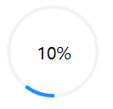
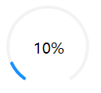

## mini-circlrProgress




### Installation

```shell
npm install mini-circleprogress
```

### Usage

```
<template>
  <div class="contentbox">
    <CircleProgress unit="300" :percent="percent" canvasId="progress" strokeType="round">
      <span slot="txt">{{percent * 100}}%</span>
    </CircleProgress>
  </div>
</template>

<script>
import CircleProgress from 'mini-circleprogress'
export default {
  data () {
    return {
      percent: 0.1
    }
  },
  components: {
    CircleProgress
  }
}
</script>

<style>
.contentbox {
  width: 300rpx;
  height: 300rpx;
}
</style>

```

### config

```js
// canvasId 「如果需要多次使用」
canvasId: {
  type: String,
  required: true
},
// 进度百分比
percent: {
  type: Number,
  default: 0.5
},
// canvas 宽度和高度
unit: {
  type: String,
  default: '150'
},
// 进度条背景颜色
strokeBgColor: {
  type: String,
  default: '#f3f3f3'
},
// 进度条颜色
strokeColor: {
  type: String,
  default: '#1890ff'
},
// 进度条宽度
strokeWidth: {
  type: Number,
  default: 4
},
// 圆形或者圆形缺口
strokeType: {
  type: String,
  default: 'gap'
}
```